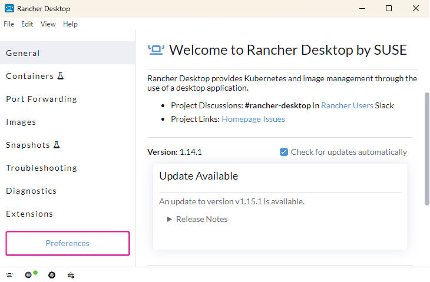
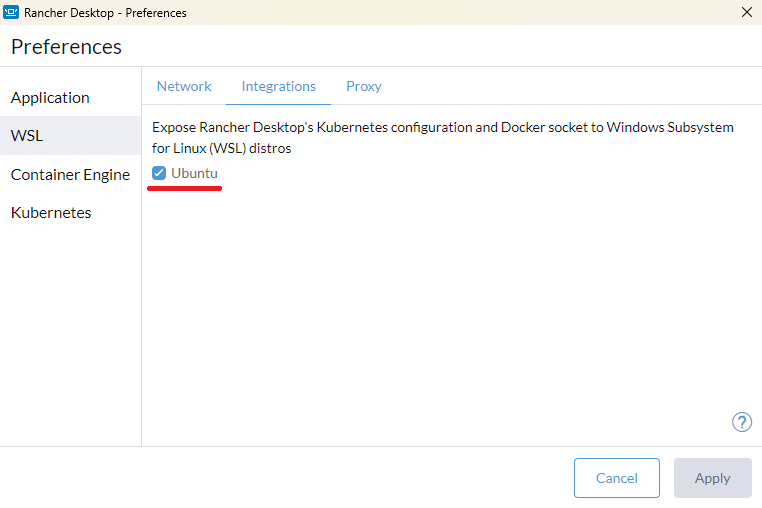
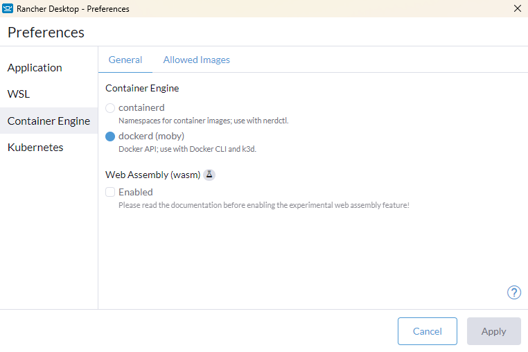

# Rancher Desktop セットアップガイド

## Rancher Desktop のインストール

* https://docs.rancherdesktop.io/getting-started/installation/

## Rancher Desktop の設定

1. Rancher Desktopを「管理者として実行」から起動する  
2. 設定画面から「Preferences」をクリックして、Preferencesダイアログを開く  
   
3. WSLの設定  
   
4. コンテナエンジンの設定  
   

## .docker/config.json の設定
環境によっては、 以下のエラーに遭遇するケースがある。

```
$ docker compose build
 => ERROR [app] resolve image config for docker-image://docker.io/docker/dockerfile:1
------
 > [app] resolve image config for docker-image://docker.io/docker/dockerfile:1:
------
failed to solve: failed to resolve source metadata for docker.io/docker/dockerfile:1:
    error getting credentials - err: exit status 127, out: ``
```
上記エラーに遭遇した場合は、 `$HOME/.docker/config.json`ファイルを次のように設定すると問題を解決できる。

```jsonc
{
    "credsStore": "pass"
}
```
