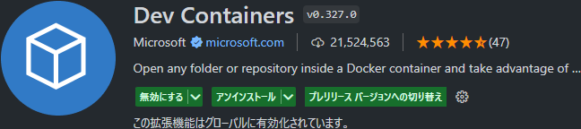
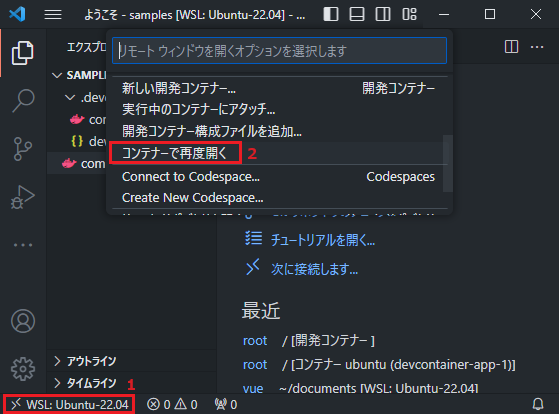
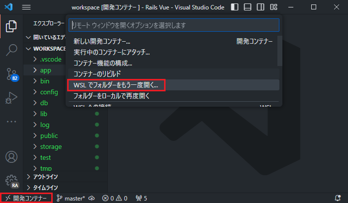

# 開発環境セットアップガイド
本章では、Dev Containerを利用した開発環境のセットアップ方法について説明する。

## Dev Containerに必要なソフトウェアの設定
下記の準備を行ってから開発環境を構築すること。

1. [WSLの設定](wsl-setup-guide.md)
2. [Rancher Desktopのインストール](rancher-setup-guide.md)
3. [Gitの設定](gitconfig-setup-guide.md)
4. [Visual Studio Codeのインストール](https://code.visualstudio.com/download)

## Dev Container環境のセットアップ
VSCodeの左サイドバーにある「拡張機能」から、「Dev Container」で検索をかけて、Dev Containerプラグインをインストールする。



Dev Containerで何らかの問題が起きた際に、仕組みを理解していないと自己解決できないため、基本的なことは以下のドキュメントにまとめている。まだ動きをあまり理解していない方は、下記のドキュメントに目を通すこと。

* [Dev Containerの基本動作とメンテナンス手順](understanding-devcontainer.md)

## リポジトリを取得する

```
$ git clone https://github.com/ochipin/go-web-template.git <PROJECT_NAME>
```
※<PROJECT_NAME>には任意の名前を指定してください。

## コンテナ起動前の事前準備と確認事項
Docker outside of Docker(DooD)を利用した開発のため、ホスト側とコンテナ側のパスを合わせる必要がある。何らかの理由により、カレントディレクトリパスが変わった場合は、以下のようなエラーメッセージが表示され、コンテナが起動できなくなる。

 * エラーメッセージ:  
   ⇒ 「devcontainer.jsonでワークスペースフォルダーが指定されていません。」

カレントディレクトリパスが変わった場合は、必ず以下の処理を行うこと。

 1. 上部のメニュー項目にある、「ターミナル」⇒「タスクの実行」の順にクリックする
 2. 「devcontainer.jsonを作成する」メニューをクリックする

この手順を実行すると、`devcontainer.json`と`override.yaml`が現在のカレントディレクトリパスで更新され、コンテナが起動できるようになる。
次節の **「開発用コンテナを起動する」** 手順より前に、この処理は済ませること。

### カレントディレクトリパスの自動更新
実際には、 `tasks.json` には次のように設定が書かれており、本開発環境のディレクトリをVSCodeで開いた時点で、カレントディレクトリパスは自動更新されるようになっている。

```jsonc
  {
    "label": "devcontainer.jsonを作成する",
    :
    // 開発環境用ディレクトリを開いた時に自動的にdevcontainer.jsonを作成する
    "runOptions": {
        "runOn": "folderOpen"
    }
  },
```
環境によっては、うまく自動更新されないケースもあるため、カレントディレクトリパスに不備が見つかった場合は、先ほどの手順で自動更新すること。

### 注意事項
自動生成される devcontainer.json, override.yaml は以下のディレクトリに保存される。

 * `/.devcontainer/setup/devcontainer.json`
 * `/.devcontainer/setup/override.yaml`

これらのファイルは、各々のローカル上に保存されるため、各自の環境に合わせて修正できる。ただし、以下の部分は自分で修正しないよう注意すること!

 * `devcontainer.json`
   ```json
   // !!! DO NOT MODIFY THIS COMMENT !!!
   "workspaceFolder": "/path/to/your/current_dir",
   ```
 * `override.yaml`
   ```yaml
   # !!! DO NOT MODIFY THIS COMMENT !!!
   - .:/path/to/your/current_dir
   ```

`DO NOT MODIFY THIS COMMENT` を含むコメント行と、その次の行は自動で更新される。そのため、決して自分では編集しないこと!

## 開発用コンテナを起動する
下記の順番通りに操作を行うだけで、開発環境がコンテナ上に作成される。初期化された`devcontainer.json`は、隠しディレクトリになっている`.devcontainer/`ディレクトリ配下に作成されるので、中身も確認すること。



### 注意点
初回起動は各種ツールやライブラリのインストール、Dockerイメージのビルドなど行うため、10分程度かかる点に注意すること。

### 共通要件
開発用コンテナは、下記の環境がデフォルトでインストールされる。

- Go
- Node
- Git

上記に関してバージョンを指定する場合は、コンテナ起動時に自動生成される`.env` ファイルの`GO_VERSION`, `NODE_VERSION`環境変数を変更すること。変更後にコンテナを再起動することで、バージョンを変更できる。

## Go + React環境
まだフロントエンドの環境を作成していない場合は、下記を参考にReact環境を構築する。

* [Go + React 開発環境セットアップガイド](go-react-setup-guide.md)

フロントエンドの環境を構築する場合は、必ずコンテナ内で行うこと。

## 開発環境の終了
左下の「開発コンテナ」をクリックし、「WSLでフォルダをもう一度開く」を選択することで、コンテナから抜ける。



コンテナから抜けた後に、`docker compose down`を実行することで、開発環境を終了できる。

```
$ docker compose down app
$ docker compose --profile development down
```

## 開発環境をクリーンにする
コンテナを停止後、`docker images`コマンドで、削除するDockerイメージの"IMAGE ID"を確認する。

```
$ docker images
REPOSITORY                     TAG      IMAGE ID      CREATED        SIZE
vsc-go-react-e372...3674-uid   latest   78ed480a8b75  23 hours ago   1.62GB
```
WindowsのDevContainerは、作成したコンテナイメージの名前がvscから始まる長い名前になっている。 確認後は以下のコマンドでコンテナイメージを削除する。

```sh
# 対象となるコンテナイメージを削除
$ docker rmi 78ed480a8b75
# ビルドキャッシュ
$ docker builder prune
$ docker image prune
```

## キャッシュデータ

### キャッシュデータの保存場所の変更
デフォルトではキャッシュデータはホストマシン側の`".cache"`ディレクトリに保存される。

```bash
PROJECT_NAME/
  `--+-- .devcontainer/
     |     `--+-- devcontainer.json
     |        +-- setup/
     |        :     :
     |        `-- override.yaml
     +-- * .cache # デフォルトでキャッシュデータが保存される場所（ホストマシン側）
     +-- compose.yaml
     :
```

キャッシュデータの保存場所を変更する場合は、`.devcontainer/override.yaml`ファイルを変更する。

```bash
PROJECT_NAME/
  `--+-- .devcontainer/
     |     `--+-- devcontainer.json
     |        +-- setup/
     |        :     :
     |        `-- override.yaml # キャッシュデータの保存先を上書きする設定
     +-- .cache
     +-- compose.yaml # docker compose の基本設定
     :
```

override.yamlファイルは、compose.yamlの設定を上書きして追加や変更を行うための設定ファイルである。

以下のように変更することで、キャッシュデータの保存場所をホストマシンのディレクトリではなく、Dockerが管理するボリューム(通常は`/var/lib/docker/volumes`配下に保存される永続ストレージ)に変更できる。

```yaml
services:
  app:
    # 他のサービス設定
    volumes:
      # 各種キャッシュデータ
      - gocache:/home/container/.cache
      - vscode:/home/container/.vscode-server

volumes:
  # キャッシュデータ用のDockerボリューム
  gocache:
  vscode:
```

### 不要なキャッシュデータを削除する
下記コマンドを実行することで、使用していないキャッシュデータは削除される。

```
docker volume prune
```
