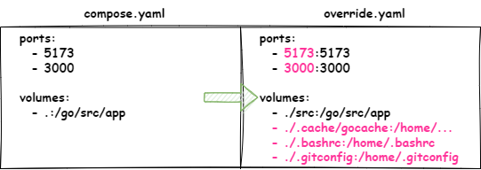

# DevContainerの動作を理解する
Dev Containerは、Dockerを利用したコンテナ開発用プラグインである。ここでは、Dev Containerの動作の流れについて説明する。主にVSCodeの左下ボタンから「コンテナを再度開く」ボタンが押された際の挙動について説明する。

## Dev Containerを使用する条件
Dev Containerは、 `.devcontainer/devcontainer.json` ファイルを用意することで実行できる。ディレクトリ構造は以下のようになっていれば問題ない。

```bash
PROJECT_NAME/
  `--+-- .devcontainer/
     |     `--+-- devcontainer.json # <-- Dev Containerはコレを使用する
     |        `-- setup/
     |              `--+-- 0.initialize.bash
     |                 +-- 1.bashrc-template.sh
     |                 +-- 2.settings-template.jsonc
     |                 `-- Dockerfile
     +-- compose.yaml 
     `-- README.md
```

次章から、Dev Containerの動きについて説明する。

## コンテナを起動する

### devcontainer.jsonを読み込む
Dev Containerからコンテナを起動すると、最初にdevcontainer.jsonを参照する。devcontainer.jsonは次のような構成で書かれており、"initializeCommand"に記載されているスクリプトを実行する。

```jsonc
{
    // Dev Containerが実行されると、"0.initialize.bash" が実行される。
    "initializeCommand": "bash .devcontainer/setup/0.initialize.bash",
    
    // docker compose up -f ../compose.yaml -f override.yaml を実行する
    "dockerComposeFile": ["../compose.yaml", "override.yaml"],
    
    // コンテナ作成後に、コンテナ内で使用するプラグインをインストールする
    "customizations": {
        "vscode": {
            "extensions": [
                // 各種拡張機能を記載する・・・
            ]
        }
    }
}
```

### "initializeCommand"の実行
このプロパティに登録されているスクリプトが実行されると、次の3つの処理を行う。

1. コンテナで使用する各ディレクトリやモジュール管理用のファイル生成を行う。
2. 各種設定ファイルや、コンテナで使用するbashrc, override.yamlなどを生成する。
3. Go,Nodeなど、開発に必要なDockerイメージを`docker pull`する。

これにより、コーディングに必要な各種ファイルが生成され、次のようなファイル構成になる。

※"*"が付与されているファイルが、生成されたファイルとなる。

```bash
PROJECT_NAME/
  `--+-- .devcontainer/
     |     `--+-- devcontainer.json
     |        +-- setup/
     |        |     `--+-- 0.initialize.bash
     |        |        +-- 1.bashrc-template.sh
     |        |        +-- 2.settings-template.jsonc
     |        |        `-- Dockerfile
     |        +-- * container.bashrc # コンテナのbashrc
     |        `-- * override.yaml    # compose.yamlの上書き設定
     +-- * .cache/  # キャッシュデータ保存場所
     +-- * .vscode/ # エディタの設定
     |       `-- settings.json
     +-- compose.yaml
     +-- * .env   # コンテナで使用する環境変数群の定義ファイル
     `-- README.md
```

下記の条件に該当する場合はエラーになる。

 1. `$HOME/.gitconfig`が存在しない
 2. 各設定ファイルの作成時に書き込み権限がない

エラーが出た場合は、内容に沿って適宜対応すること。

### コンテナの起動準備開始
`"initializeCommand"`が正常終了した後に、次の"compose.yaml"ファイルを使用して、コンテナの起動を行う。

```yaml
services:
  app:
    build:
      context: .
      # docker buildを行う
      dockerfile: ./.devcontainer/setup/Dockerfile
      # 下記環境変数は、"initializeCommnad"で生成された.envの内容である
      args:
        - USERID=${UID}
        - GROUPID=${GID}
        - GO_VERSION=${GO_VERSION}
        - NODE_VERSION=${NODE_VERSION}
      target: ${STAGE_BUILD}
    image: go-react-template
    env_file:
      - .env
```

### コンテナのビルド
コンテナ起動時に、まだDockerイメージが作成されていない場合は、.devcontainer配下のDockerfileを使用してコンテナをビルドする。

```bash
PROJECT_NAME/
  `--+-- .devcontainer/
     |     `--+-- devcontainer.json
     |        `-- setup/
     |              `--+-- 0.initialize.bash
     |                 +-- 1.bashrc-template.sh
     |                 +-- 2.settings-template.jsonc
     |                 `-- Dockerfile # コレを使ってビルドする
     +-- compose.yaml
     `-- README.md
```

### コンテナを起動する
ビルドしたDockerイメージを使用してコンテナを起動する。コンテナの起動は2つのYAMLファイルが使用される。

| ファイル名 | 説明 |
|:--            |:--     |
| compose.yaml  | git管理されている、共通の設定ファイル |
| override.yaml | git管理されていない、自分専用のコンテナ設定ファイル |

ポート番号を変えたい、マウントするファイルを変えたいなど、自分用にコンテナの設定をカスタマイズする場合は、override.yamlを編集すること。これにより、以下のようにcompose.yamlの設定を上書きできる。

※赤字部分が上書きされた設定となる。



コンテナの起動が終わると、コンテナへアタッチされる。

---

以上がDevContainerの動作となる。すべてGUI上から自動的に処理が行われる。
