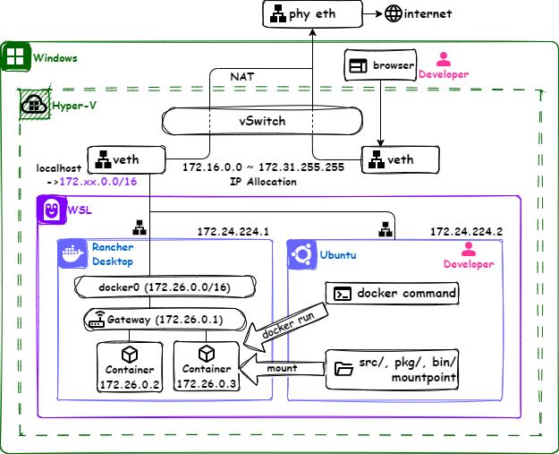

WSL(Windows Subsystem for Linux)セットアップガイド
===
WSLは、Windows上でLinuxディストリビューションをネイティブに実行できる機能である。

Windows 10以降のバージョンに標準で備わっており、設定を有効にすることで利用可能になる。Windows上でWebアプリケーションの開発を行う際に、以下の利点があるためセットアップを強く推奨する。

1. Linuxコマンドが利用できる
2. 必要なツールをWSL内にインストールすることで、Windowsのシステムディレクトリに影響を与えない
3. bashやzshなどのシェルを使用することで、PowerShellよりもUnixライクな操作が可能になる
4. Rancher Desktopなどのコンテナ環境を使用する場合、WSLの利用が必須となる

ここでは、WSLのセットアップ方法について説明する。

## WSLを有効にする
Rancher Desktopなどのコンテナ環境は、以下のようにWSL上で動作する仕様なので、WSL環境が必須となる。



また、WSLはHyper-Vを使用してLinuxが動く仕組みのため、Windows 11 以前のOSを使用している場合は、必ず下記の手順でWSL環境を有効にすること。

* [WSLを使用してWindowsにLinuxをインストールする方法](https://learn.microsoft.com/ja-jp/windows/wsl/install)

## Windows Terminalをインストールする
Windows Terminalは、WSL上のLinuxへ簡単にアクセスする機能を持ったターミナルソフトである。インストールされていない場合は、Microsoft Storeからインストールすること。

 * https://apps.microsoft.com/detail/9n0dx20hk701

Windows Terminalの背景色やフォントサイズなどの設定方法は[Microsoft公式のヘルプ](https://learn.microsoft.com/ja-jp/windows/terminal/customize-settings/profile-general)になるので、設定方法が分からない場合は参照すること。

## インストールできるディストリビューションを確認する
`wsl --list --online`コマンドを実行して、WSLにインストールできるディストリビューションを確認する。

```
PS> wsl --list --online
インストールできる有効なディストリビューションの一覧を次に示します。
'wsl.exe --install <Distro>' を使用してインストールします。

NAME                                   FRIENDLY NAME
Ubuntu                                 Ubuntu
Debian                                 Debian GNU/Linux
kali-linux                             Kali Linux Rolling
Ubuntu-18.04                           Ubuntu 18.04 LTS
Ubuntu-20.04                           Ubuntu 20.04 LTS
Ubuntu-22.04                           Ubuntu 22.04 LTS
Ubuntu-24.04                           Ubuntu 24.04 LTS
OracleLinux_7_9                        Oracle Linux 7.9
OracleLinux_8_7                        Oracle Linux 8.7
OracleLinux_9_1                        Oracle Linux 9.1
openSUSE-Leap-15.5                     openSUSE Leap 15.5
SUSE-Linux-Enterprise-Server-15-SP4    SUSE Linux Enterprise Server 15 SP4
SUSE-Linux-Enterprise-15-SP5           SUSE Linux Enterprise 15 SP5
openSUSE-Tumbleweed                    openSUSE Tumbleweed
PS>
```
Ubuntuは情報も多く、何らかの問題が発生したとしても自己解決できる可能性が高いため、Ubuntuを強く推奨する。

## WSLをアップデートする
Ubuntuインストール時にWSLのバージョンが古く、Ubuntuがインストールできない場合があるので、なるべくWSLを最新バージョンへアップデートする。
```
PS> wsl --update
```

## Ubuntuをインストールする

PowerShellを起動して、`wsl --install Ubuntu`コマンドを実行してUbuntuをインストールする。

```
PS> wsl --install Ubuntu
インストール中: Ubuntu LTS
Ubuntu LTS がインストールされました。
Ubuntu LTS を起動しています...
Installing, this may take a few minutes...
Please create a default UNIX user account. The username does not need to match your Windows username.
For more information visit: https://aka.ms/wslusers
 :
```

コマンドを実行してからしばらくすると、UbuntuのユーザIDとパスワードの入力を求められるので入力する。

```
Enter new UNIX username: <任意のIDを入力>
New password:　<入力したIDに付随するパスワードを入力>
Retype new password: <パスワードを確認>
```

入力後インストールが無事完了すると下記の画面が出力される。
 
```
Installation successful!
To run a command as administrator (user "root"), use "sudo <command>".
See "man sudo_root" for details.

Welcome to Ubuntu LTS (GNU/Linux 5.15.146.1-microsoft-standard-WSL2 x86_64)

 * Documentation:  https://help.ubuntu.com
 * Management:     https://landscape.canonical.com
 * Support:        https://ubuntu.com/pro

 System information as of Thu May  2 22:19:25 JST 2024

  System load:  0.32                Processes:             78
  Usage of /:   0.1% of 1006.85GB   Users logged in:       0
  Memory usage: 26%                 IPv4 address for eth0: 172.22.11.36
  Swap usage:   0%

This message is shown once a day. To disable it please create the
/home/ochipin/.hushlogin file.
userid@pcname:~$ 
```

## インストールしたディストリビューションを確認する

"\*"がついているものがデフォルトで選択されているディストリビューションとなる。`wsl -l -v`コマンドで確認できる。

```
PS> wsl -l -v
  NAME       STATE       VERSION
* Ubuntu     Running     2
```

`wsl`コマンド実行時に"\*"で選択されているディストリビューションが起動する。もし"\*"が付与されていない場合は、下記のコマンドを実行してデフォルトで選択されている状態にすること。

```powershell
PS> wsl -s Ubuntu
```

また、もし"VERSION"が "1" になっていた場合、以下の方法で "2" にしておくことを推奨する。

```
PS> wsl --set-version Ubuntu 2
```

## WSL上のLinuxを起動
`wsl -d <distroName>`コマンドで起動できる。
```
PS> wsl -d Ubuntu
```

## WSL上のLinuxを停止
`wsl -t <distroName>`で停止できる。
```
PS> wsl -t Ubuntu
```

## 不要になったディストリビューションを削除する
ディストリビューションが不要になったら下記のコマンドを実行して削除する。
```
PS> wsl --unregister Ubuntu
登録解除。
この操作を正しく終了しました。
```
